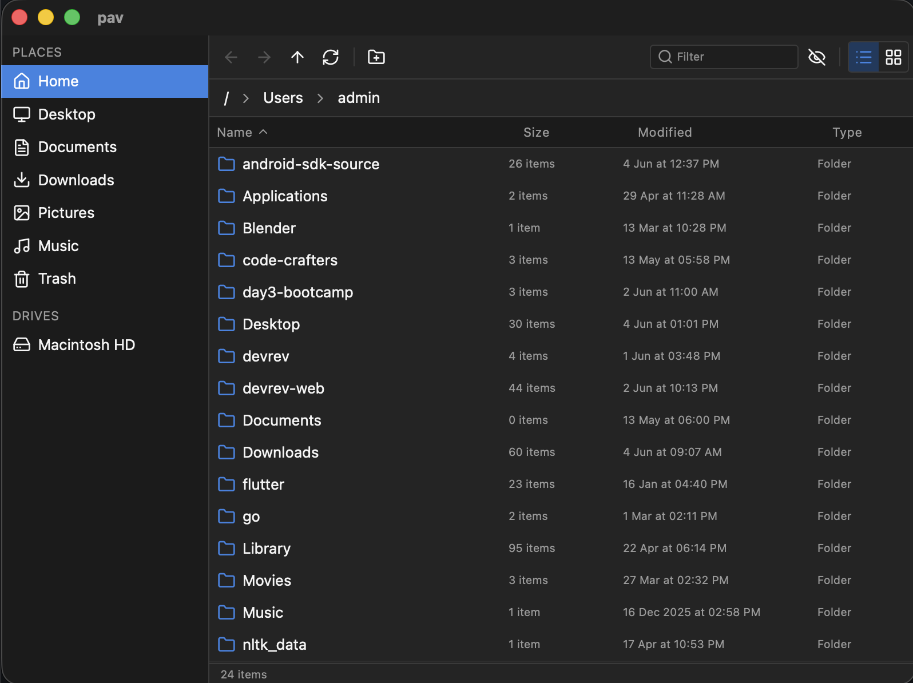

# pav

A cross-platform, Nautilus-inspired file manager built on Tauri 2 and React 19.
All filesystem work runs in Rust and is exposed to the renderer through typed
`invoke` commands, so the webview never receives broad filesystem capabilities.

## ScreenShots


## Features

### Navigation
- Browser-style history: back, forward, up, with clickable breadcrumbs.
- Sidebar with Home and the standard XDG-style locations (Desktop, Documents,
  Downloads, Pictures, Music, Videos, Trash) plus mounted drives.
- Single-click to enter a folder; double-click a file to open it in the default
  application.
- Open in Terminal for the selected folder or current directory.

### Views
- List view with sortable columns: name, size / item count, modified, type
  (folders-first ordering).
- Icon grid view that reflows responsively to the container width.
- View mode toggle persists across navigation.
- Both views are virtualized via `@tanstack/react-virtual`, so directories with
  tens of thousands of entries stay responsive.
- Automatic light / dark theme based on `prefers-color-scheme`.

### File operations
- New folder, rename, copy, cut, paste with automatic name-collision handling
  (`name (2).ext` style).
- Move to Trash via the native recycle bin (`trash` crate).
- Copy as Path for selected items or the current directory.
- Cross-device moves transparently fall back to copy-then-delete.

### UX
- Show / hide dotfiles, client-side filter box, and refresh.
- Full keyboard support (see [Keyboard shortcuts](#keyboard-shortcuts)).
- Cursor-anchored context menu for items and the empty pane.
- Errors bubble up as a serialized `AppError` and surface in a dismissible
  banner.

### Platform-specific
- macOS Trash fallback: when TCC blocks direct enumeration of `~/.Trash`, the
  app queries Finder via AppleScript to retrieve the item list, then `stat`s
  each item individually (which TCC permits). The first time Trash is opened,
  macOS prompts for Automation access to Finder.

## Tech stack

| Layer     | Libraries                                                                 |
| --------- | ------------------------------------------------------------------------- |
| Shell     | Tauri 2, tauri-plugin-opener, tauri-plugin-dialog                         |
| Rust deps | `trash`, `thiserror`, `serde`, `serde_json`                               |
| Frontend  | React 19, TypeScript 5.8, Vite 7, Tailwind CSS v4                         |
| State     | Zustand                                                                   |
| UI        | lucide-react (icons), `@tanstack/react-virtual` (list + grid virtualizer) |
| Tooling   | Bun                                                                       |

## Prerequisites

- [Rust](https://www.rust-lang.org/tools/install) (stable toolchain)
- [Bun](https://bun.sh)
- Platform-specific Tauri prerequisites: see the
  [official prerequisites guide](https://tauri.app/start/prerequisites/).

## Getting started

```sh
bun install
bun tauri dev
```

## Building

```sh
bun tauri build
```

The bundled app appears under `src-tauri/target/release/bundle/`.

## Scripts

| Script             | Purpose                                              |
| ------------------ | ---------------------------------------------------- |
| `bun run dev`      | Start the Vite dev server (renderer only)            |
| `bun run build`    | Type-check with `tsc` and produce a Vite build       |
| `bun run preview`  | Preview the built renderer                           |
| `bun tauri dev`    | Run the desktop app in development mode              |
| `bun tauri build`  | Produce a release bundle for the current platform    |

## Keyboard shortcuts

| Action                   | Shortcut                           |
| ------------------------ | ---------------------------------- |
| Go back / forward        | `Alt + Left` / `Alt + Right`       |
| Go up one level          | `Backspace`                        |
| Open selection           | `Enter`                            |
| Rename selected item     | `F2`                               |
| Move to Trash            | `Delete` or `Cmd/Ctrl + Backspace` |
| Select all               | `Cmd/Ctrl + A`                     |
| Copy / Cut / Paste       | `Cmd/Ctrl + C / X / V`             |
| New folder               | `Cmd/Ctrl + N`                     |
| Refresh                  | `Cmd/Ctrl + R`                     |

## Project layout

```
src/
  App.tsx                 Shell composition, dialogs, context menu wiring
  main.tsx                React entry, Tailwind import
  index.css               Tailwind + theme tokens (light / dark)
  lib/
    tauri.ts              Typed invoke wrappers + DirEntry / Location / Drive
    format.ts             formatBytes, formatDate, file-type icon mapping
  store/
    useFileStore.ts       Zustand store: path, history, selection, clipboard,
                          view mode, sort, show-hidden, search
  hooks/
    useKeyboard.ts        Global keybindings
  components/
    Sidebar.tsx           Places + drives
    Toolbar.tsx           Back/forward/up, new folder, search, hidden, view
    Breadcrumbs.tsx       Path breadcrumbs (POSIX and Windows aware)
    FileList.tsx          Virtualized list view with sortable columns
    FileGrid.tsx          Virtualized responsive grid view
    ContextMenu.tsx       Cursor-anchored context menu primitive
    dialogs.tsx           PromptDialog + ConfirmDialog

src-tauri/
  Cargo.toml              Rust dependencies
  capabilities/
    default.json          Plugin permissions (core, opener, dialog)
  src/
    main.rs               Thin entry point
    lib.rs                Plugin registration + invoke handler
    error.rs              AppError enum, serialized as a string to the webview
    fs_ops.rs             list_dir, create_dir, rename, copy_paths,
                          move_paths, move_to_trash, open_path, open_terminal,
                          path_exists, parent_dir
    locations.rs          home_dir, common_locations, get_drives
```

## Architecture notes

- The frontend never touches the filesystem directly. Every operation goes
  through a `#[tauri::command]` in `src-tauri/src/`, which means the `fs`
  capability does not need to be granted to the webview. This keeps the attack
  surface small and avoids Tauri v2 scope-management plumbing.
- `DirEntry` carries `item_count` for folders so the list view can show
  "N items" where files show their formatted size.
- `copy_paths` / `move_paths` handle same-directory collisions by picking a
  unique `name (2).ext` style filename. Cross-device moves fall back to
  copy-then-delete.
- The grid view recomputes its column count from the container width via a
  `ResizeObserver` and virtualizes over rows. The list view virtualizes over
  fixed-height rows.

## Rust command surface

All commands return `Result<T, AppError>` unless noted.

| Command            | Arguments                            | Returns          |
| ------------------ | ------------------------------------ | ---------------- |
| `list_dir`         | `path: String, show_hidden: bool`    | `Vec<DirEntry>`  |
| `path_exists`      | `path: String`                       | `bool`           |
| `parent_dir`       | `path: String`                       | `Option<String>` |
| `create_dir`       | `parent: String, name: String`       | `String`         |
| `rename`           | `from: String, to: String`           | `()`             |
| `move_to_trash`    | `paths: Vec<String>`                 | `()`             |
| `copy_paths`       | `src: Vec<String>, dest_dir: String` | `()`             |
| `move_paths`       | `src: Vec<String>, dest_dir: String` | `()`             |
| `open_path`        | `path: String`                       | `()`             |
| `open_terminal`    | `path: String`                       | `()`             |
| `home_dir`         | `()`                                 | `String`         |
| `common_locations` | `()`                                 | `Vec<Location>`  |
| `get_drives`       | `()`                                 | `Vec<Drive>`     |

`DirEntry` is `{ name, path, is_dir, is_symlink, size, modified_ms, extension, item_count }`.

## Platform behavior

| Concern          | macOS                            | Windows                                             | Linux                                                                                                              |
| ---------------- | -------------------------------- | --------------------------------------------------- | ------------------------------------------------------------------------------------------------------------------ |
| Drives / volumes | `/Volumes` contents              | Logical drive letters (`A:\` – `Z:\`)               | Single root (`/`)                                                                                                  |
| Trash shortcut   | `~/.Trash` (via Finder fallback) | Not exposed (Recycle Bin is not a browsable folder) | `$XDG_DATA_HOME/Trash/files` or `~/.local/share/Trash/files`                                                       |
| Move to Trash    | `trash` crate via NSFileManager  | `trash` crate via Recycle Bin                       | `trash` crate via XDG spec                                                                                         |
| Open in Terminal | `open -a Terminal <dir>`         | `cmd /C start "" cmd` in `<dir>`                    | Tries `x-terminal-emulator`, `gnome-terminal`, `konsole`, `xfce4-terminal`, `alacritty`, `kitty`, `wezterm`, `xterm` |

## Verification checklist

- `bun run build` completes without TypeScript errors.
- `cd src-tauri && cargo check` and `cargo clippy --no-deps` are clean.
- Sidebar shows Home and standard locations; clicking each navigates.
- Breadcrumbs navigate; back / forward / up behave like a browser.
- List / grid toggle persists through navigation; grid reflows on resize.
- New folder, rename, and Move to Trash all round-trip via the store.
- Copy + paste duplicates to the destination; cut + paste moves.
- Double-click on a file opens it in the default application.
- Open in Terminal launches the platform terminal at the expected directory.
- Opening a very large directory keeps the rendered DOM bounded (verify in
  DevTools that only the visible rows are present).